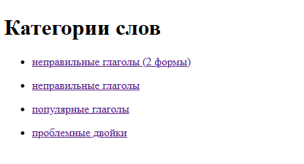
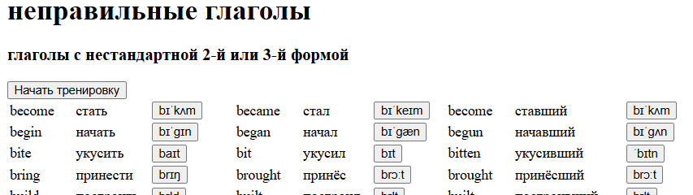
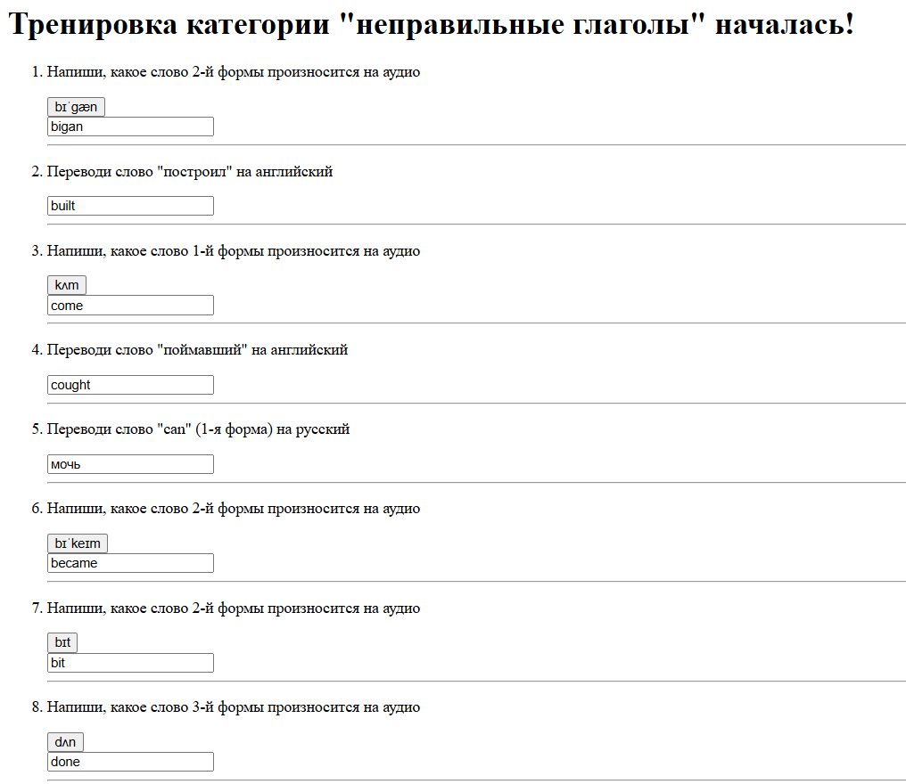
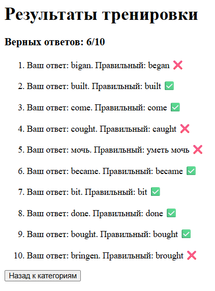

### Просмотр категорий

### Просмотр таблицы слов

При нажатии на кнопку с транскрипцие происодит переход на страницу с прослушиванием.
При нажатии "Начать тренировку" начинается выбор части слов для тренировки

# Тренировка
### Выбор слов для тренировки

### Тренировка

От 3 до 11 типов вопросов в зависимости от категории слов.
После нажатии кнопки внизу "Отправить ответы" переходит на страницу с результатами

### Результаты
