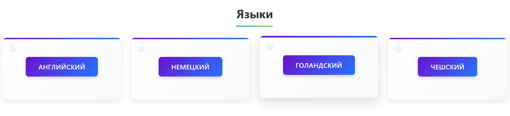
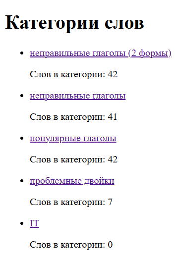
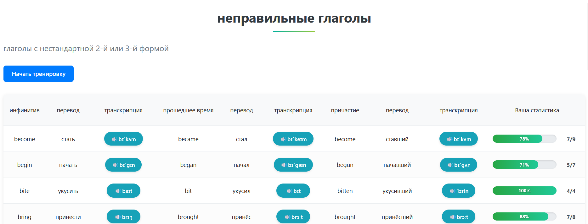
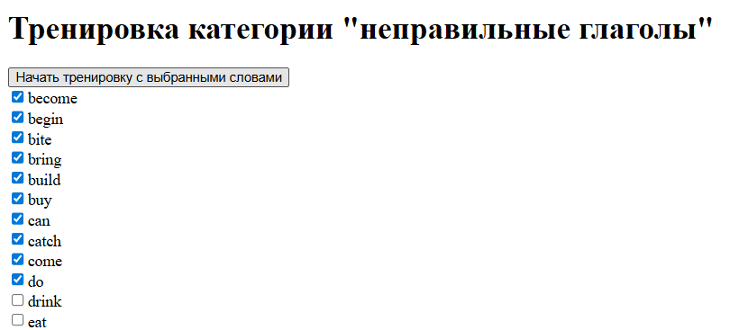
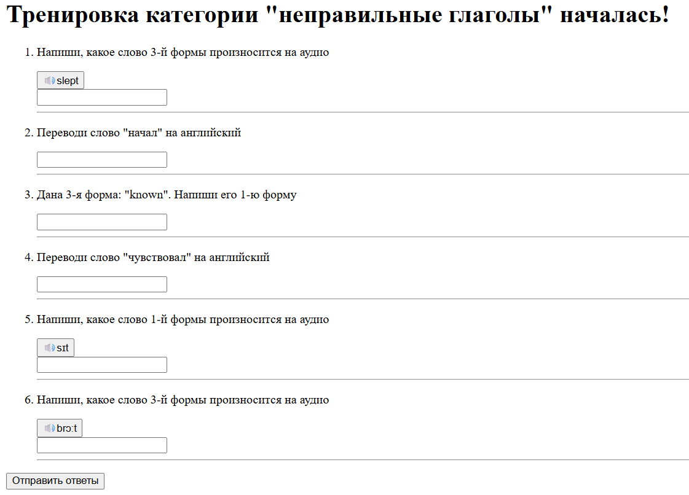
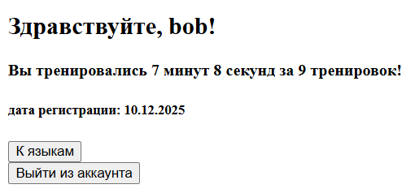

### Языки

У администратора появляются кнопки для удаления и добавления языков
### Просмотр категорий

У администратора появляются кнопки для удаления и добавления категорий

### Просмотр таблицы слов

При нажатии на кнопку с транскрипцией происходит загрузка и проигрывание аудио.
При нажатии "Начать тренировку" начинается выбор части слов для тренировки. 
Для авторизированных пользователей появляется дополнительный столбец со 
статистикой вопросов с этим словом (сколько правильных ответов и сколько всего ответов) 
У администратора появляются кнопки для удаления и добавления слов

### Выбор слов для тренировки

### Тренировка

От 3 до 11 типов вопросов в зависимости от категории слов.
После нажатия кнопки внизу "Отправить ответы" переходит на страницу с результатами

### Результаты

### Личный кабинет
